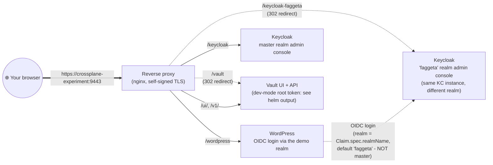
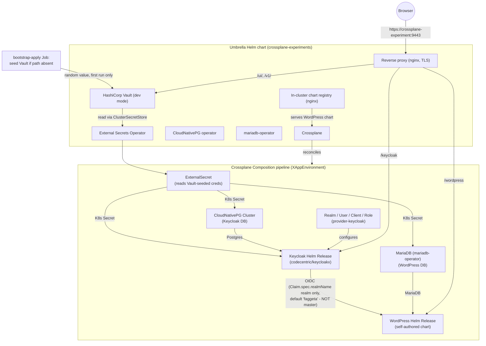

# crossplane-experiments

A single Helm "umbrella" chart that stands up a complete demo of a
Crossplane Composition provisioning **WordPress + Keycloak + MariaDB
(for WordPress) + PostgreSQL (for Keycloak)**, with WordPress
authenticating exclusively, via OIDC, against a single dedicated
Keycloak realm named by the Claim's `realmName` field (`faggeta` by
default) — **never** Keycloak's own `master` realm.

Every password/secret this demo uses (DB passwords, Keycloak admin
password, etc) is generated and stored **only in HashiCorp Vault** —
never in the Crossplane Claim, in Helm values, or anywhere else
plaintext-readable via `kubectl get -o yaml`/`helm get values`. A
one-time idempotent seeding step (part of the `bootstrap-apply` hook
Job) writes a random value into each Vault path the first time it's
missing; the **External Secrets Operator** then continuously pulls
those values out of Vault into native Kubernetes Secrets for every
consumer to read, same as before.

No Bitnami images/charts are used anywhere. Every component is either
an official upstream chart/image or self-authored:

| Component            | Source                                                    |
|-----------------------|------------------------------------------------------------|
| Crossplane            | `https://charts.crossplane.io/stable` (official)           |
| metrics-server        | `https://kubernetes-sigs.github.io/metrics-server/` (official) |
| CloudNativePG         | `https://cloudnative-pg.github.io/charts` (official)        |
| mariadb-operator      | `oci://ghcr.io/mariadb-operator/charts` (official)          |
| HashiCorp Vault       | `https://helm.releases.hashicorp.com` (official, dev-mode)  |
| External Secrets Operator | `https://charts.external-secrets.io` (official, CNCF)   |
| Keycloak              | `codecentric/keycloakx` chart, `quay.io/keycloak/keycloak` image |
| WordPress             | self-authored chart (`charts/wordpress/`), official `wordpress` image |
| Chart registry        | plain `nginx:1.27-alpine` serving a classic Helm chart repo |
| Reverse proxy          | plain `nginx:1.27-alpine`, self-signed TLS                  |

## One-command install

```bash
./scripts/deploy.sh
```

This creates the kind cluster `cnpg-crossplane` (if it doesn't already
exist, using `kind-config.yaml` - includes the port mapping used by the
reverse-proxy URL below), (re)packages the self-authored WordPress chart,
refreshes the umbrella chart's Helm dependencies, and
`helm upgrade --install`s everything: Crossplane, CloudNativePG,
mariadb-operator, providers, the XRD/Composition, the in-cluster chart
registry, the reverse proxy, and (by default) a demo claim instantiating
the full WordPress+Keycloak+MariaDB+Postgres stack. It's safe to re-run
any time you change something - the cluster is reused and the Helm
release is upgraded in place. Any extra arguments are passed straight
through to `helm upgrade --install` (e.g. `./scripts/deploy.sh --debug`).

To tear everything down (deletes the kind cluster entirely - the demo
has no state outside it, since Vault runs in dev/in-memory mode):

```bash
./scripts/destroy.sh
```

To also remove everything `deploy.sh` downloads or generates locally
(the Helm repos it registers, the dependency tarballs in `chart/charts/`,
and the packaged WordPress chart + `index.yaml` in `chart/files/` — all
git-ignored, not committed), without touching the cluster:

```bash
./scripts/purge.sh
```

Equivalently, by hand:

```bash
# 1. Create the kind cluster (includes the port mapping used by the
#    reverse-proxy URL below).
kind create cluster --config kind-config.yaml

# 2. Package the WordPress chart and fetch the dependency charts (needs
#    the `helm repo add` commands from scripts/deploy.sh first).
./scripts/build-charts.sh
helm dependency build chart/

# 3. Install everything: Crossplane, CloudNativePG, mariadb-operator,
#    providers, the XRD/Composition, the in-cluster chart registry, the
#    reverse proxy, and (by default) a demo claim instantiating the
#    full WordPress+Keycloak+MariaDB+Postgres stack.
helm install crossplane-experiments chart/ -n crossplane-system --create-namespace
```

That's it — within a couple of minutes the whole stack (Crossplane,
operators, Keycloak, its Postgres, WordPress, its MariaDB, the OIDC
Realm/User/Client wiring) reconciles automatically. Re-run
`helm upgrade crossplane-experiments chart/ -n crossplane-system` any
time you change something.

If you change the self-authored WordPress chart under `charts/wordpress/`,
regenerate the embedded package/index first (the output in
`chart/files/` is git-ignored and rebuilt on every `deploy.sh` run):

```bash
./scripts/build-charts.sh
```

## Checking it's working

```bash
kubectl get release.helm.crossplane.io -n default
kubectl get realm.realm.keycloak.crossplane.io,user.user.keycloak.crossplane.io,client.openidclient.keycloak.crossplane.io
kubectl get pods -n default
kubectl top nodes
kubectl top pods -A
```

The umbrella chart installs metrics-server with the Kind-specific
`--kubelet-insecure-tls` option, enabling the Kubernetes Metrics API used
by `kubectl top`.

### Single external URL

The chart also deploys a small nginx reverse proxy (self-signed TLS)
exposing everything under one address. All of these URLs are also
printed by `helm install`/`helm upgrade` itself (see
`chart/templates/NOTES.txt`), so you don't need to hunt for them here:



- `https://crossplane-experiment:9443/wordpress` -> WordPress
  (OIDC login against the realm named by the Claim's `realmName` field,
  `faggeta` by default — **never** the `master` realm)
- `https://crossplane-experiment:9443/keycloak` -> Keycloak
  (`master` realm admin console / general access — unrelated to the
  realm WordPress logs into)
- `https://crossplane-experiment:9443/keycloak-faggeta` -> a
  client-side (302) redirect straight to
  `https://crossplane-experiment:9443/keycloak/admin/faggeta/console`,
  i.e. the **same Keycloak instance**, but the `faggeta` realm's own
  admin console — the realm WordPress actually authenticates against,
  still served through the same `/keycloak` proxy path above
- `https://crossplane-experiment:9443/vault` -> a client-side (302)
  redirect to Vault's UI at `/ui/` (dev-mode root token is `root` — see
  "Changing a vaulted secret's value directly in the Vault UI" below
  before editing anything there)
- `https://crossplane-experiment:9443/ui/` and `/v1/` -> Vault's UI
  and API directly (Vault hardcodes these absolute paths itself, so
  unlike WordPress/Keycloak it can't be rebased under a `/vault`
  prefix — see the note in `reverse-proxy-nginx.conf.template`)

External Secrets Operator ships no web UI of its own; inspect its
objects instead with `kubectl get/describe externalsecret,clustersecretstore`.

To reach it from your host:

1. Add a hosts entry (or just use `localhost`):
   ```
   echo "127.0.0.1 crossplane-experiment" | sudo tee -a /etc/hosts
   ```
2. Make sure the kind cluster was created with `kind-config.yaml`
   (maps host port `9443` -> the reverse proxy's NodePort `30443`).
3. Browse to any of the URLs above (accept the self-signed certificate
   warning).

> Note: the proxy preserves each app's full path prefix (`/wordpress`,
> `/keycloak`) all the way to the backend instead of stripping it, and
> both apps are configured to know they're mounted at that prefix —
> WordPress's Apache has a matching `Alias` (see
> `charts/wordpress/templates/apache-subpath-configmap.yaml`) and
> Keycloak's `http.relativePath` is set to `/keycloak` (see
> `composition.yaml`). This matters because both apps generate their
> own redirects (e.g. Apache's `mod_dir` adding a trailing slash to
> `/wordpress/wp-admin`, or Keycloak adding one to
> `/keycloak/admin/<realm>/console`) using whatever path prefix and
> Host header *they* were given — if the proxy had stripped the
> prefix or passed the internal Service hostname, those self-generated
> redirects would point at an unreachable internal/prefix-less URL.
> The proxy also passes through the real external `Host` header
> (`$http_host`, not a hardcoded internal DNS name) and rewrites any
> plain-`http://` redirect the backends emit back to `https://` via
> `proxy_redirect` (neither Apache nor Keycloak know TLS is terminated
> upstream by the proxy, since the proxy-to-backend hop is plain HTTP).
> Vault's UI is the one exception: it hardcodes its own absolute
> `/ui/`/`/v1/` paths with no equivalent of a configurable prefix, so
> it's proxied at those exact paths instead of under `/vault`.

## Architecture

See `chart/manifests/composition.yaml` for the full Crossplane
Composition. Key points:



- Vault is the actual source of truth for every password/secret this
  demo uses — not the Claim, not Helm values. The `bootstrap-apply` hook
  Job seeds each Vault path with a random value exactly once (only if
  that path has no data yet, so `helm upgrade` never rotates/clobbers
  an existing deployment's secrets); the Composition then only ever
  *reads* from Vault, via an `ExternalSecret` backed by ESO's
  `ClusterSecretStore` (`vault-backend`) — see the `vaultBackedSecret`
  helper in `chart/templates/_helpers.tpl`, the seeding script and
  ProviderConfig/ClusterSecretStore wiring in
  `chart/templates/bootstrap-apply.yaml`, and `vaultSecrets.seedOverrides`
  in `chart/values.yaml` if you need a pinned (non-random) value for
  CI/reproducibility. This keeps every existing consumer (Helm chart
  values, `provider-kubernetes` Objects) reading a plain Secret,
  unchanged.
- WordPress's OIDC plugin (`daggerhart-openid-connect-generic`) is
  configured with endpoint URLs locked to a single realm — whichever
  one the Claim's `spec.realmName` resolves to (`faggeta` by default,
  **not** `master`, and not the literal string "setup" either; see
  `composition.yaml`'s `keycloak-realm` resource) — it cannot
  authenticate against any other Keycloak realm.
- The self-authored WordPress chart (`charts/wordpress/`) is packaged
  and served from an in-cluster classic Helm chart repository (plain
  HTTP, not OCI — see the note in `chart/templates/chart-registry.yaml`
  about a `provider-helm` OCI/TLS bug that this sidesteps).
- Secrets/ProviderConfigs/the demo Claim that depend on CRDs installed
  asynchronously by Crossplane's package manager are applied via a
  `post-install,post-upgrade` hook Job (`chart/templates/bootstrap-apply.yaml`)
  that polls for the CRDs before applying.
- An explicit Helm test Job
  (`chart/templates/helm-test.yaml`) waits for the
  WordPress `Deployment` to report a ready replica (polling
  `status.readyReplicas` rather than `kubectl rollout status`, which
  keeps failing once the Deployment's progress deadline has been
  exceeded during a slow first image pull, even if the pods become Ready
  later), checks WordPress answers over HTTP (printing the `curl` exit
  code if it doesn't), and then performs a real
  Keycloak OIDC password-grant login as the demo user, failing the
  `helm test` command (non-zero exit) if either check doesn't pass. The
  deployment script runs this test after installing or upgrading; when
  using Helm directly, run
  `helm test crossplane-experiments -n crossplane-system --logs --timeout 5m`.
  A successful install alone confirms resource creation, while a
  successful test confirms the end-to-end behavior. It also self-heals the one known
  `provider-helm` flakiness this demo hits on slower machines: a
  Release's own Helm-SDK install/upgrade call can time out (no
  configurable timeout field exists on the `Release` CRD) while a
  large image is still being pulled for its post-install hook Job,
  landing the Release in Helm's `failed` state even though that hook
  Job goes on to complete successfully moments later. If you ever hit
  this by hand (`kubectl get release.helm.crossplane.io` showing
  `STATE: failed` for a Release whose own hook Job has actually
  completed), the fix is the same one the smoke test automates:
  `kubectl patch release.helm.crossplane.io/<name> --type merge -p
  '{"spec":{"forProvider":{"values":{"forceResyncNonce":"<any new
  value>"}}}}'` to force `provider-helm` to detect drift and retry.
  The smoke test deliberately does **not** hard-gate on the Claim's own
  `Ready` condition first, since that condition can stay stuck at
  `False` from this same stale-Release-status lag long after the
  environment is actually healthy — it relies on the real,
  ground-truth checks instead.

### Changing a vaulted secret's value directly in the Vault UI

Every vaulted secret (`keycloak/db-credentials`,
`keycloak/admin-secret`, `keycloak/demo-user-password`,
`wordpress/oidc-client-secret`, `wordpress/mariadb-credentials`,
`wordpress/admin-secret`) is reachable and editable through the Vault
UI (`/vault` or `/ui/`, see "Single external URL" above). Vault really
is this demo's only source of truth for these values now — there's no
Crossplane push loop to revert your edit. **What happens next if you
edit one, however, differs by secret**, for cybersecurity awareness
here's exactly why, tracing the actual data flow:

```
bootstrap-apply Job (one-time, only if path has no data yet)
   --(random value, or vaultSecrets.seedOverrides.* if set)-->
Vault KV path (e.g. keycloak/db-credentials)   <-- you'd edit here
   --(ExternalSecret, refreshInterval: 1m, pull-only)-->
Kubernetes Secret actually consumed by the app (e.g. keycloak-db-credentials)
   --(see below: either auto-rotated, or read once at pod start)-->
the running Postgres role password / MariaDB user password / app's in-memory config
```

Within about a minute of any Vault edit, the `ExternalSecret` pulls
your edited value and overwrites the consumer Kubernetes `Secret` with
it, and it **stays there** (nothing pushes the old value back anymore).
What happens after that depends on which secret you changed:

#### `keycloak/db-credentials` and `wordpress/mariadb-credentials` — **auto-rotated**

These two are the only secrets with native operator-level support for
continuous password reconciliation, so this demo wires it up end to
end — editing either of these in Vault **does** rotate the real,
live database credential, with no manual steps or restarts required:

- `keycloak-db-credentials` carries a `cnpg.io/reload: "true"` label
  (added via `vaultBackedSecret`'s `extraLabels`), which makes
  CloudNativePG reconcile immediately on any change to the Secret. A
  dedicated `DatabaseRole` resource (`keycloak-postgres-role` in
  `composition.yaml`, a `postgresql.cnpg.io/v1 DatabaseRole` applied
  via `provider-kubernetes`) continuously watches that same Secret and
  runs `ALTER ROLE ... PASSWORD ...` against the live `keycloak`
  Postgres role whenever it changes.
- `wordpress-mariadb-credentials` carries a `k8s.mariadb.com/watch:
  "true"` label, which mariadb-operator's `MariaDB` CR natively
  understands for its inline `passwordSecretKeyRef` — it watches the
  Secret and runs `ALTER USER ... IDENTIFIED BY ...` against the live
  MariaDB user whenever it changes.
- In both cases this is **credential rotation only** — the already
  established connections in a running Postgres/WordPress pod session
  aren't forcibly dropped, but any new connection (including the next
  one a restarted pod makes) must use the new password. No
  CrashLoopBackOff risk for *this* pair of secrets.
- MariaDB's **root** password (`rootPasswordSecretKeyRef`) has no
  equivalent watch-support in mariadb-operator, so it is intentionally
  **not** part of this rotation path — only the WordPress application
  user is automated.

#### `keycloak/demo-user-password` — **auto-rotated (composition-native CronJob)**

Keycloak's Admin REST API has no endpoint to read back a user's
current password, so `provider-keycloak`'s `User.spec.forProvider.
initialPassword` field is (by design — hence the name) create-only:
it's never re-applied after the user first exists, so there's nothing
a native Crossplane patch/diff can reconcile here. Instead,
`composition.yaml` composes a `keycloak-demo-user-password-sync`
`CronJob` (a plain `kubernetes.crossplane.io/v1alpha1 Object`, same
idiom as `bootstrap-apply`) that runs every minute and unconditionally
`PUT`s the current value of the `keycloak-demo-user-password` Secret
to Keycloak's `reset-password` endpoint, authenticating with the admin
credential built elsewhere in the same Composition. Repeating the same
write every tick — rather than diffing — **is** Crossplane's
reconcile-to-desired-state idempotency, just expressed via Keycloak's
write-only API instead of a diffable CRD field. Live-tested: editing
this Vault path fully propagates to a working Keycloak login within
about a minute, no manual steps.

#### `wordpress/oidc-client-secret` — **auto-rotated (native `provider-keycloak` reconciliation, slower cycle)**

Unlike `initialPassword`, the `Client.spec.forProvider.
clientSecretSecretRef` field is a regular (non-"initial") field, so
`provider-keycloak` *does* continuously reconcile it — editing this
Vault path does eventually change the real Keycloak client secret, no
extra automation needed. The catch: `provider-keycloak`'s poll/reconcile
interval for this resource is noticeably slower than the `ExternalSecret`'s
1-minute `refreshInterval` (live-tested at ~5 minutes), so don't be
fooled by a quick check showing no change — give it longer. WordPress
itself still needs a manual restart afterwards (see below).

#### `keycloak/admin-secret` and `wordpress/admin-secret` — **manual rotation + restart required, by design**

These two are intentionally left out of any auto-rotation:

- `keycloak/admin-secret` is Keycloak's root/break-glass admin
  credential — it's also what `provider-keycloak`'s own `ProviderConfig`
  uses to authenticate to Keycloak's Admin API for *every* other
  managed resource. Automating its rotation hits a genuine
  chicken-and-egg problem: whatever job rotates it would need to keep
  authenticating with the very credential it's replacing mid-flight.
  Real-world practice treats root credentials like this the same way —
  deliberate, manual, ceremony-gated rotation, not silent background
  automation.
- `wordpress/admin-secret` is set once via `wp-cli` inside WordPress's
  init container — there's no Keycloak (or any operator) involved at
  all, so the composition-native CronJob trick used above doesn't
  apply; rotating it for real would need a different mechanism
  entirely (e.g. `kubectl exec`-based `wp-cli` invocation with
  dedicated RBAC).

Keycloak and WordPress only read these two as environment variables at
pod startup — there is no operator watching them for live changes. If
you edit one of these in Vault:

1. **The actual credential never rotates on its own.**
2. **This can cause an outage with no real security benefit on its
   own**: if the affected pod happens to restart while your edited
   (now-mismatched) value is live in its Secret, it will try to
   authenticate with the wrong credential and fail/crash-loop until
   you either revert the Vault value or manually rotate the real
   credential to match.

**To actually rotate one of these**, edit the value in Vault (or
`kubectl delete secret <consumer-secret>` to force an immediate
`ExternalSecret` re-sync) **and** separately rotate the real credential
through Keycloak's own admin API/console or `wp-cli`, **and** restart
the consumer pod so it picks up the new value — so both stay in sync.

