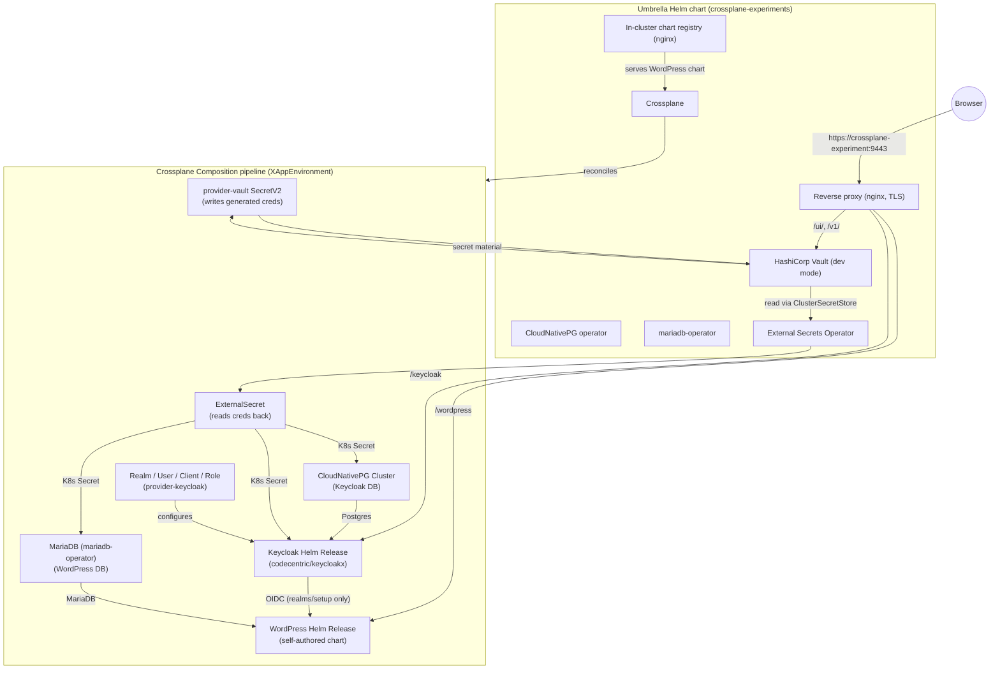

# crossplane-experiments

A single Helm "umbrella" chart that stands up a complete demo of a
Crossplane Composition provisioning **WordPress + Keycloak + MariaDB
(for WordPress) + PostgreSQL (for Keycloak)**, with WordPress
authenticating exclusively against Keycloak's `setup` realm via OIDC.
Every generated secret (DB passwords, Keycloak admin password, etc) is
sourced from **HashiCorp Vault** and synced into native Kubernetes
Secrets by the **External Secrets Operator**.

No Bitnami images/charts are used anywhere. Every component is either
an official upstream chart/image or self-authored:

| Component            | Source                                                    |
|-----------------------|------------------------------------------------------------|
| Crossplane            | `https://charts.crossplane.io/stable` (official)           |
| CloudNativePG         | `https://cloudnative-pg.github.io/charts` (official)        |
| mariadb-operator      | `oci://ghcr.io/mariadb-operator/charts` (official)          |
| HashiCorp Vault       | `https://helm.releases.hashicorp.com` (official, dev-mode)  |
| External Secrets Operator | `https://charts.external-secrets.io` (official, CNCF)   |
| Keycloak              | `codecentric/keycloakx` chart, `quay.io/keycloak/keycloak` image |
| WordPress             | self-authored chart (`charts/wordpress/`), official `wordpress` image |
| Chart registry        | plain `nginx:1.27-alpine` serving a classic Helm chart repo |
| Reverse proxy          | plain `nginx:1.27-alpine`, self-signed TLS                  |

## One-command install

```bash
# 1. Create the kind cluster (includes the port mapping used by the
#    reverse-proxy URL below).
kind create cluster --config kind-config.yaml

# 2. Install everything: Crossplane, CloudNativePG, mariadb-operator,
#    providers, the XRD/Composition, the in-cluster chart registry, the
#    reverse proxy, and (by default) a demo claim instantiating the
#    full WordPress+Keycloak+MariaDB+Postgres stack.
helm install crossplane-experiments chart/ -n crossplane-system --create-namespace
```

That's it — within a couple of minutes the whole stack (Crossplane,
operators, Keycloak, its Postgres, WordPress, its MariaDB, the OIDC
Realm/User/Client wiring) reconciles automatically. Re-run
`helm upgrade crossplane-experiments chart/ -n crossplane-system` any
time you change something.

If you change the self-authored WordPress chart under `charts/wordpress/`,
regenerate the embedded package/index first:

```bash
./scripts/build-charts.sh
```

## Checking it's working

```bash
kubectl get release.helm.crossplane.io -n default
kubectl get realm.realm.keycloak.crossplane.io,user.user.keycloak.crossplane.io,client.openidclient.keycloak.crossplane.io
kubectl get pods -n default
```

### Single external URL

The chart also deploys a small nginx reverse proxy (self-signed TLS)
exposing everything under one address. All of these URLs are also
printed by `helm install`/`helm upgrade` itself (see
`chart/templates/NOTES.txt`), so you don't need to hunt for them here:

- `https://crossplane-experiment:9443/wordpress` -> WordPress
  (OIDC login via Keycloak's `setup` realm)
- `https://crossplane-experiment:9443/keycloak` -> Keycloak
  (master realm admin console / general access)
- `https://crossplane-experiment:9443/keycloak-faggeta` -> a
  client-side (302) redirect straight to
  `https://crossplane-experiment:9443/keycloak/admin/faggeta/console`,
  i.e. the Keycloak `faggeta` realm's admin console, still served
  through the same `/keycloak` proxy path above
- `https://crossplane-experiment:9443/vault` -> a client-side (302)
  redirect to Vault's UI at `/ui/` (dev-mode root token is `root`)
- `https://crossplane-experiment:9443/ui/` and `/v1/` -> Vault's UI
  and API directly (Vault hardcodes these absolute paths itself, so
  unlike WordPress/Keycloak it can't be rebased under a `/vault`
  prefix — see the note in `reverse-proxy-nginx.conf.template`)

External Secrets Operator ships no web UI of its own; inspect its
objects instead with `kubectl get/describe externalsecret,clustersecretstore`.

To reach it from your host:

1. Add a hosts entry (or just use `localhost`):
   ```
   echo "127.0.0.1 crossplane-experiment" | sudo tee -a /etc/hosts
   ```
2. Make sure the kind cluster was created with `kind-config.yaml`
   (maps host port `9443` -> the reverse proxy's NodePort `30443`).
3. Browse to any of the URLs above (accept the self-signed certificate
   warning).

> Note: the proxy preserves each app's full path prefix (`/wordpress`,
> `/keycloak`) all the way to the backend instead of stripping it, and
> both apps are configured to know they're mounted at that prefix —
> WordPress's Apache has a matching `Alias` (see
> `charts/wordpress/templates/apache-subpath-configmap.yaml`) and
> Keycloak's `http.relativePath` is set to `/keycloak` (see
> `composition.yaml`). This matters because both apps generate their
> own redirects (e.g. Apache's `mod_dir` adding a trailing slash to
> `/wordpress/wp-admin`, or Keycloak adding one to
> `/keycloak/admin/<realm>/console`) using whatever path prefix and
> Host header *they* were given — if the proxy had stripped the
> prefix or passed the internal Service hostname, those self-generated
> redirects would point at an unreachable internal/prefix-less URL.
> The proxy also passes through the real external `Host` header
> (`$http_host`, not a hardcoded internal DNS name) and rewrites any
> plain-`http://` redirect the backends emit back to `https://` via
> `proxy_redirect` (neither Apache nor Keycloak know TLS is terminated
> upstream by the proxy, since the proxy-to-backend hop is plain HTTP).
> Vault's UI is the one exception: it hardcodes its own absolute
> `/ui/`/`/v1/` paths with no equivalent of a configurable prefix, so
> it's proxied at those exact paths instead of under `/vault`.

## Architecture

See `chart/templates/04-composition.yaml` for the full Crossplane
Composition. Key points:



- Vault is the single source of truth for every generated secret
  (DB passwords, Keycloak admin password, etc). The Composition writes
  each secret into Vault via `provider-vault`'s `SecretV2`, then reads
  it back into a native Kubernetes `Secret` via an `ExternalSecret`
  backed by ESO's `ClusterSecretStore` (`vault-backend`) — see the
  `vaultBackedSecret` helper in `chart/templates/_helpers.tpl` and the
  ProviderConfig/ClusterSecretStore wiring in
  `chart/templates/bootstrap-apply.yaml`. This keeps every existing
  consumer (Helm chart values, `provider-kubernetes` Objects) reading a
  plain Secret, unchanged.
- WordPress's OIDC plugin (`daggerhart-openid-connect-generic`) is
  configured with endpoint URLs hardcoded to `realms/setup` only — it
  cannot authenticate against any other Keycloak realm.
- The self-authored WordPress chart (`charts/wordpress/`) is packaged
  and served from an in-cluster classic Helm chart repository (plain
  HTTP, not OCI — see the note in `chart/templates/chart-registry.yaml`
  about a `provider-helm` OCI/TLS bug that this sidesteps).
- Secrets/ProviderConfigs/the demo Claim that depend on CRDs installed
  asynchronously by Crossplane's package manager are applied via a
  `post-install,post-upgrade` hook Job (`chart/templates/bootstrap-apply.yaml`)
  that polls for the CRDs before applying.
